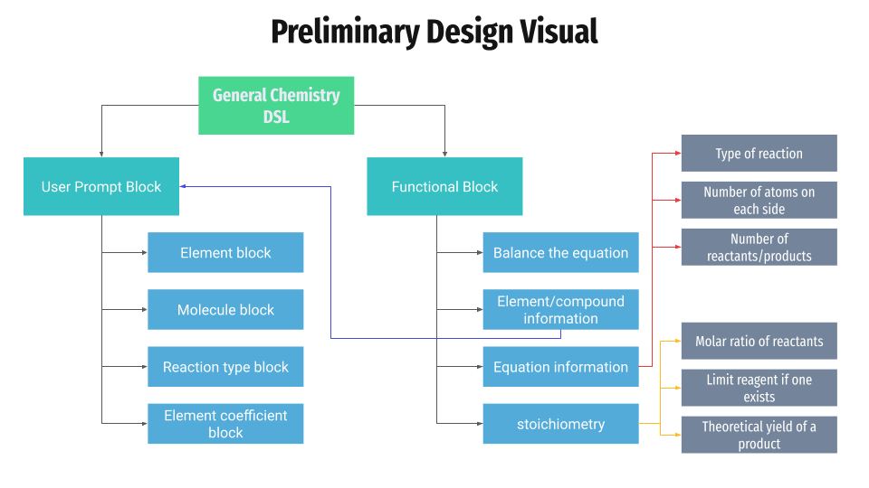

# Preliminary Design
## Components of the Chemical Equation
### Element Block:
* Used to represent an individual chemical element (ex. H, He, Li, Be)
* Could either let the user input directly or have a select group of elements that are supported that the user can choose from

### Molecule Block:
* Used to represent molecules composed of elements (ex. H2O, O2, NO3)
* Could allow user to snap together element blocks and have the option to subscript each element
* The lack of a subscript could be treated as a default of 1

### Reaction Type Block:
* Used to represent the type of reaction being represented.
* Single arrow for a one-way reaction and a double arrow for equilibrium reactions
* Serves as a separater for reactants and products

### Element Coefficient Block:
* Used to add coefficients in front of elements
* Users can input a number and snap the block in front of elements and molecules
* Could be used for balancing chemical equations

## Functional Blocks
### Balance the Equation Block:
* Used to allow the user to have the program balance a chemical equation
* Not sure how to approach automated balancing yet using blockly

### Element and Compound Information Block:
* Used to display individual element information
* Can be helpful in testing to make sure each element is being interpreted properly and that the properties of each element are correct

### Equation Information Block: 
* Used to display a description of the equation.
* Type of reaction
* Number of reactants and products
* If the equation is balanced
* Number of atoms on each side
* Can bring up the element and compound information blocks
* Can be helpful in testing to make sure the equation is being interpreted properly

### Stoichiometry Block(s):
* Could be broken down into other options
* Should only be able to be attached to balanced chemical equations (so through the balance the equation block?)
* Determine molar ratios of reactants and products
* Determine limiting reagent if one exists
* Determine the theoretical yield of a product
* Convert between mass and moles of a substance
* Could add enthalpy calculations in the future
* Could add PVnRT options in the future

